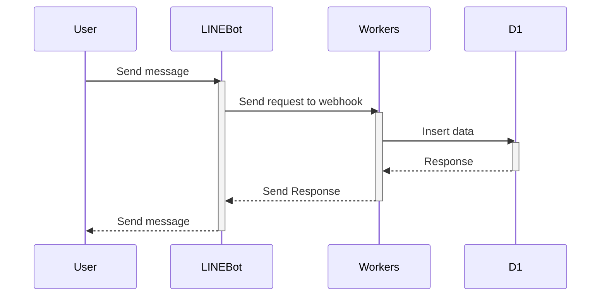
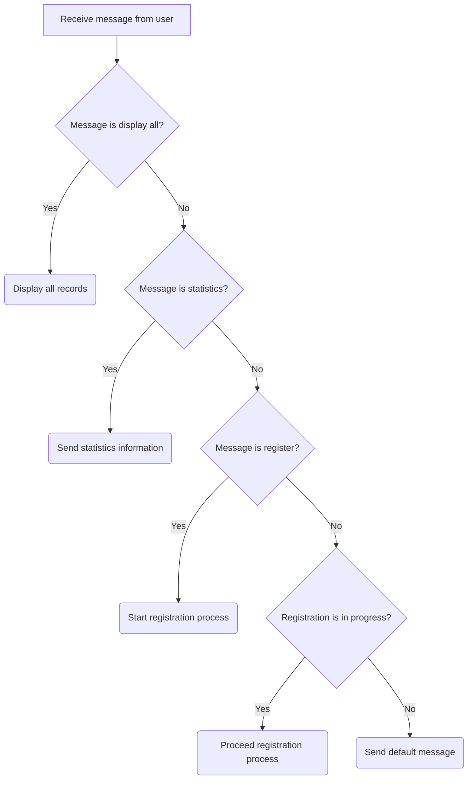

# Blood Pressure Recoder bot

LINE bot to record blood pressure.

## Sequence



## Getting Started

```
npm install
npm run dev
```

```
npm run deploy
```

## Registration Flow

### Default flow


